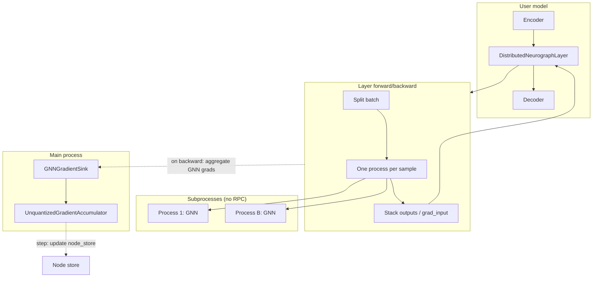

# Distributed Training

This document describes the distributed training path **used by `distributed_training.py`**: the `DistributedNeurographLayer`, the **GNNAdam** optimizer, and how they work together. It does **not** cover other code in `distributed/` (e.g. `DistributedNeurographStack`, RPC workers) that exists but is not used by `distributed_training.py`.

---

## 1. Quick start: forward-only

Minimal example: load config, define a model that uses the distributed GNN layer, create random input, run one forward pass, and print the output.

Input shape is `(B, input_nodes, vector_dim)` and output shape is `(B, output_nodes)`. These come from your config: `graph.input_nodes`, `graph.output_nodes`, and `model.vector_dim` (see e.g. `training_runs/example_config.yaml`). GNN weights live in the node store (e.g. Qdrant); workers load the model from config and sync weights.

```python
import torch
from torch import nn
from distributed import DistributedNeurographLayer
from main import load_config

CONFIG_PATH = "training_runs/example_config.yaml"  # or your config path
cfg = load_config(CONFIG_PATH)

# Minimal model: encoder reshapes to (B, input_nodes, vector_dim), then GNN
B, input_nodes = 4, cfg["graph"]["input_nodes"]
vector_dim = cfg["model"]["vector_dim"]
output_nodes = cfg["graph"]["output_nodes"]

class MinimalModel(nn.Module):
    def __init__(self, cfg):
        super().__init__()
        self.gnn = DistributedNeurographLayer(cfg)

    def forward(self, x):
        return self.gnn(x)

model = MinimalModel(cfg)
x = torch.randn(B, input_nodes, vector_dim)
out = model(x)
print(out.shape)  # (B, output_nodes)
print(out)
```

---

## 2. GNNAdam and training loop

When the model contains a **DistributedNeurographLayer**, you must use **GNNAdam** (not plain `torch.optim.Adam`) so that GNN gradients are consumed and GNN parameters are updated. GNNAdam is a single optimizer that:

- Updates **head parameters** (encoder, decoder, linear layers, etc.) with standard Adam every `step()`.
- Discovers each `DistributedNeurographLayer` in the model and uses its `gradient_sink` and `accumulator` to feed GNN gradients and run accumulator steps. No manual wiring is required.

Usage: `optimizer = GNNAdam(model, lr=..., betas=..., eps=...)`. The training loop is the same as usual: `optimizer.zero_grad()`, forward, loss, `loss.backward()`, `optimizer.step()`.

Minimal training example:

```python
import torch
from torch import nn
from distributed import DistributedNeurographLayer, GNNAdam
from main import load_config

CONFIG_PATH = "training_runs/example_config.yaml"
cfg = load_config(CONFIG_PATH)

class MyModel(nn.Module):
    def __init__(self, cfg):
        super().__init__()
        self.linear = nn.Linear(4, 16)
        self.tanh = nn.Tanh()
        self.gnn = DistributedNeurographLayer(cfg)

    def forward(self, x):
        B = x.size(0)
        x = x.squeeze(1)
        h = self.tanh(self.linear(x))
        h = h.view(B, 4, 4)  # (B, input_nodes, vector_dim)
        return self.gnn(h)

model = MyModel(cfg)
optimizer = GNNAdam(model, lr=1e-3, betas=(0.9, 0.999), eps=1e-8)
criterion = nn.CrossEntropyLoss()

# One batch step
x = torch.randn(8, 1, 4)
y = torch.randint(0, 3, (8,))
optimizer.zero_grad()
logits = model(x)
loss = criterion(logits, y)
loss.backward()
optimizer.step()
```

There is no separate accumulator process to join. The accumulator runs in-process; GNNAdam drives it on each `step()`.

---

## 3. How the distributed GNN layer works

The layer used by `distributed_training.py` is **DistributedNeurographLayer** in `distributed/layer.py`. It uses one process per sample (multiprocessing), no RPC.

### 3.1 Interface

- **Input:** `x` of shape `(B, input_nodes, vector_dim)` (from config: `graph.input_nodes`, `model.vector_dim`).
- **Output:** Tensor of shape `(B, output_nodes)` on the same device as `x` (from config: `graph.output_nodes`).

### 3.2 Forward path

- `DistributedNeurographLayer.forward(x)` calls `_OneProcessPerSampleFunction.apply(x, config, None, gradient_sink)`.
- For each sample index `i` in `0..B-1`, a **separate process** is spawned that runs `run_one_sample_forward_only(i, x[i], config, output_queue)` (see `distributed/worker.py`).
- Each worker: builds the model via `_load_model_for_config(config)` (which uses `initialize_model_and_nodestore` from `core`), syncs GNN weights from the node store, runs `model(x_i)`, and puts `(sample_idx, out_np, None)` on the queue. Output is sent as a numpy copy to avoid cross-process tensor sharing.
- The main process: collects `B` results from the queue, stacks them in sample order, and returns a tensor on `x.device`. Worker outputs are detached; there is no autograd across processes.

**Why one process per sample:** GNN state (e.g. `active_nodes`) is per-process. Using one process per sample avoids clearing or resetting state between samples and keeps worker logic simple.

### 3.3 Backward path

When autograd calls the custom Function’s `backward(ctx, grad_output)`:

- For each sample `i`, a process is spawned that runs `run_one_sample_backward_only(i, x[i], config, grad_output[i], output_queue)`.
- Each worker: loads the model, syncs weights, runs full forward and then `out.backward(grad_i)`, gets `(phase_grads, mag_grads)` from `model.gnn.get_grads()` and `input_grad` from `x_i.grad`, and sends back numpy/cpu dicts and array.
- The main process: aggregates `phase_grads` and `mag_grads` by node_id (sum) and tracks per-node frequencies (how many samples contributed). It then calls `gradient_sink.add(phase_acc, mag_acc, phase_freq, mag_freq)`. It stacks the input grads into `grad_input` with the same dtype/device as `grad_output` and returns it so autograd can propagate gradients to the layer’s inputs (encoder, etc.).

**Design choice:** PyTorch autograd does not span processes. The custom `torch.autograd.Function` runs forward/backward in subprocesses and assembles `grad_input` and GNN parameter gradients explicitly.

---

## 4. GNNAdam, gradient sink, and accumulator

### 4.1 Gradient sink (GNNGradientSink)

- **Role:** Process-local container that holds GNN gradients produced during the last backward. The custom Function’s `backward` writes aggregated `(phase_grads, mag_grads)` and optional per-node frequencies into the sink via `add(...)`.
- **Why:** Backward runs in the main process, but the actual GNN gradients are computed in worker processes and sent back. The sink is the handoff so the optimizer (GNNAdam) can consume them on `step()` without using a queue or another process.
- **API:** `add(phase_grads, mag_grads, phase_grad_freq, mag_grad_freq)`; `get_and_clear()` returns and clears the stored values; `clear()` discards without returning. Implemented in `distributed/gnn_grad_sink.py`.

### 4.2 Gradient accumulator (UnquantizedGradientAccumulator)

- **Role:** Accumulates GNN gradients over multiple backward passes (e.g. over `accumulation_steps` batches). When it has enough, it applies updates (SGD with momentum) to the GNN parameters stored in the **node store** (e.g. Qdrant), not as `nn.Parameter`s.
- **Why:** GNN parameters live in the node store; they are not part of the PyTorch parameter list, so standard optimizers do not see them. The accumulator receives dicts of (node_id → phase/mag gradients), optionally with frequencies, and on `step()` updates node vectors via `node_store.update_vectors(...)`.
- **Flow:** GNNAdam gets gradients from the sink with `get_and_clear()`, then calls `accumulator.receive_gradients(phase_grads, mag_grads, phase_grad_freq, mag_grad_freq)` and `accumulator.step()` for each `DistributedNeurographLayer`. Implemented in `core/gradient_accumulator.py`.

### 4.3 GNNAdam

- **Role:** Single optimizer for the whole model. Discovers all `DistributedNeurographLayer` instances (via `model.modules()`), collects their `gradient_sink` and `accumulator`. Registers only **head parameters** with Adam (`model.parameters()`).
- **zero_grad:** Zeros gradients for head parameters (standard) and clears all gradient sinks so old GNN gradients are not reused.
- **step:** (1) For each layer: get gradients from the sink (`get_and_clear`), feed to the accumulator (`receive_gradients`), then call `accumulator.step()` to update GNN params in the node store. (2) Call `super().step()` to perform the Adam step on head parameters. Implemented in `distributed/gnn_optimizer.py`.

### 4.4 Normal (head) parameter gradients

`loss.backward()` fills `.grad` on all parameters that participated in the graph (encoder, decoder, linear layers). GNN parameters do not appear in `model.parameters()`, so their gradients are never stored in `.grad`; they are sent from workers to the sink, then from the sink to the accumulator. Summary:

- **Head params:** standard autograd and Adam (`.grad` + `optimizer.step()`).
- **GNN params:** sink → accumulator → node_store updates (no `.grad`).

---

## 5. Architecture overview



On `loss.backward()`:

1. Gradients flow through the decoder (and any layers after the GNN).
2. The custom Function’s `backward` is called with `grad_output`.
3. One process per sample runs forward + backward and returns (param grads, input grad); the main process aggregates param grads, calls `gradient_sink.add(...)`, and returns stacked `grad_input`.
4. Autograd continues through the encoder.

On `optimizer.step()` (GNNAdam):

1. For each `DistributedNeurographLayer`: get gradients from the sink, feed to the accumulator, call `accumulator.step()` (updates GNN params in the node store).
2. Run Adam step on head parameters.

---

## 6. File layout (path used by distributed_training.py)

| Path | Role |
|------|------|
| `distributed_training.py` | Example: Iris model with `DistributedNeurographLayer` and `GNNAdam`, standard training loop, TensorBoard. Imports `DistributedNeurographLayer`, `GNNAdam` from `distributed`, `load_config` and `load_iris_dataset` from `main`. No accumulator process. |
| `distributed/__init__.py` | Re-exports `DistributedNeurographLayer`, `GNNAdam`, `GNNGradientSink` from layer, gnn_optimizer, gnn_grad_sink. |
| `distributed/_imports.py` | Adds parent to `sys.path` so `layer`/`worker` can import from `main` and `core`. |
| `distributed/layer.py` | Defines `DistributedNeurographLayer` (owns gradient_sink, node_store, accumulator) and `_OneProcessPerSampleFunction` (forward/backward; passes gradient_sink; no gradient_queue on this path). Imports `load_config`, `get_node_store_from_config`, `GNNGradientSink`, `UnquantizedGradientAccumulator`, and worker as `worker_mod`. |
| `distributed/gnn_optimizer.py` | GNNAdam: discovers `DistributedNeurographLayer` instances, uses their gradient_sink and accumulator; zero_grad clears sinks; step feeds sink → accumulator.step() then Adam for head params. |
| `distributed/gnn_grad_sink.py` | GNNGradientSink: process-local container for (phase_grads, mag_grads, frequencies); add, get_and_clear, clear. |
| `distributed/worker.py` | `run_one_sample_forward_only`, `run_one_sample_backward_only`, `_load_model_for_config` (used by the layer’s custom Function). Same file contains RPC-related code for `DistributedNeurographStack`, not used by `distributed_training.py`. |
| `distributed/_config_utils.py` | `get_node_store_from_config`: builds node_store from config; used by the layer to construct the accumulator. |
| `core/gradient_accumulator.py` | `UnquantizedGradientAccumulator`: used in-process by the layer; GNNAdam calls `receive_gradients` and `step` to update GNN params in the node store. |

Config used by this path: `training.accumulation_steps`, `training.lr`, `training.momentum`, `training.epochs`; `graph.*`, `model.*`, `qdrant.*`, `system.*`. `training.worker_count` is not used (each sample gets its own process).

No edits are made to `main.py`, `model_wrapper.py`, or the rest of `core/` for this path.
