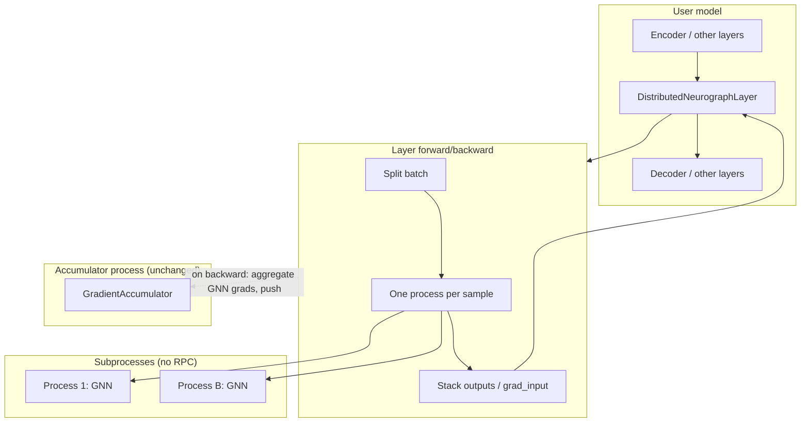

# Distributed Training

This document describes the distributed training path **used by `distributed_training.py`**: the problems it addresses, how it is implemented, and how to use it. It does **not** cover other code in `distributed/` (e.g. `DistributedNeurographStack`, RPC workers) that exists but is not used by `distributed_training.py`.

---

## 1. Problems Addressed

### 1.1 Original pipeline was not a differentiable layer

The original training pipeline used **its own gradient accumulator** and a multi-process layout (data queue → workers → gradient queue → accumulator). Each worker:

- Pulled `(data, target)` from a queue
- Ran `out = model(data)`, `loss = criterion(out, target)`, `loss.backward()` entirely inside that process
- Called `model.gnn.get_grads()` and put `(phase_grads, mag_grads)` on `gradient_queue`
- Never participated in a single end-to-end autograd graph

The GNN was never designed as an `nn.Module` that could be dropped into a larger model and trained with one `loss.backward()`.

### 1.2 No gradient w.r.t. input

Because backward was confined to each worker, the model did **not** propagate gradients back to its inputs. There was no `d(loss)/d(input)` exposed for upstream layers. To combine the GNN with other PyTorch modules (e.g. `encoder → GNN → decoder`) in one backward, the distributed layer must:

- Accept `grad_output` in backward
- Run backward through the GNN on workers
- Return **grad_input** so autograd can continue through the layers that produced the GNN input

### 1.3 Autograd does not span processes

PyTorch’s autograd graph does not cross process boundaries. The original design had workers in separate processes, each with their own graph from input to loss. To get a single backward that updates encoder, GNN, and decoder, we use **custom autograd**: a `torch.autograd.Function` that runs forward/backward in subprocesses and assembles `grad_input` and parameter grads explicitly.

### 1.4 Other constraints

- **Per-node gradient accumulation** is unchanged: the existing `GradientAccumulator` and `gradient_accumulator_process_fn` are reused. The layer feeds `(phase_grads, mag_grads)` into the same queue that the accumulator consumes.
- **Core untouched:** `main.py`, `model_wrapper.py`, and all of `core/` are unchanged. New code lives under `distributed/` and in `distributed_training.py`.

---

## 2. DistributedNeurographLayer (one process per sample)

The only distributed abstraction used by `distributed_training.py` is **DistributedNeurographLayer**. It uses one process per sample (multiprocessing), no RPC.

### 2.1 Idea

- **Forward:** For a batch of size `B`, spawn `B` processes. Each process loads the model from config, runs forward for one sample, and puts its output on a queue. The master stacks results and returns a tensor that is part of the caller’s graph (worker outputs are detached copies).
- **Backward:** Given `grad_output`, spawn `B` processes again. Each process loads the model, runs forward and backward for one sample, and returns (parameter grads, gradient w.r.t. its input). The master aggregates parameter grads, pushes them to `gradient_queue`, and stacks input grads into `grad_input` for the custom Function.

So the GNN is a “subprocess oracle”: no shared autograd across processes; the custom Function provides the derivatives by re-running forward/backward in separate processes and assembling them.

### 2.2 Components used by this path

- **`distributed/layer.py`**
  - **`_OneProcessPerSampleFunction`**  
    - `forward(ctx, x, config, gradient_queue)`: for each sample `i`, spawns a process that runs `worker.run_one_sample_forward_only(i, x[i], config, output_queue)`. Each subprocess loads the model, runs `model(x_i)`, and puts `(sample_idx, out_np, None)` on the queue. Master stacks outputs and returns `stack_out.to(x.device)`.  
    - `backward(ctx, grad_output)`: for each sample `i`, spawns a process that runs `worker.run_one_sample_backward_only(i, x[i], config, grad_output[i], output_queue)`. That process does full forward + backward, then returns `(phase_grads, mag_grads, input_grad)` as numpy/cpu; master converts back to tensors, aggregates phase/mag by node_id, puts `(phase_dict, mag_dict)` on `gradient_queue`, and stacks input grads into `grad_input` with same dtype/device as `grad_output` so autograd can attach it to the input of the layer.
  - **`DistributedNeurographLayer`**  
    - `__init__(self, config)`: loads config, creates `gradient_queue`, starts one accumulator process via `gradient_accumulator_process_fn(self._gradient_queue, cfg, ...)`, then returns.  
    - `forward(self, x)`: returns `_OneProcessPerSampleFunction.apply(x, self._config, self._gradient_queue)`.  
    - `shutdown()`: puts `None` in the gradient queue and joins the accumulator process.

- **`distributed/worker.py`** (only these are on the path)
  - **`run_one_sample_forward_only(sample_idx, x_i, config, output_queue)`**  
    Target for a single forward-only process. Builds the model with `_load_model_for_config(config)`, syncs weights, runs `model(x_i)`, puts `(sample_idx, out_np, None)` (or an exception in the third slot).
  - **`run_one_sample_backward_only(sample_idx, x_i, config, grad_i, output_queue)`**  
    Target for a single backward process. Builds the model, runs forward and `out.backward(grad_i)`, then `model.gnn.get_grads()`, and sends back `(sample_idx, pg_np, mg_np, ig_np, None)` with numpy dicts and array for input grad so no shared memory is passed.
  - **`_load_model_for_config(config)`**  
    Used by the two above; builds the model via `initialize_model_and_nodestore` and config.

- **`distributed/_imports.py`**  
  Adds the parent directory to `sys.path` so `distributed` can import from `main` and `core` without modifying them.

### 2.3 Design choices and trade-offs

- **One process per sample:** Avoids shared GNN state and `active_nodes` across samples within a process; each process runs one sample and exits. No need to clear or reset state between samples in a single process.
- **No RPC:** Uses `multiprocessing.Process` and `multiprocessing.Queue` only. Each forward/backward round spawns and joins many processes.
- **Reuse of accumulator:** Same `gradient_accumulator_process_fn` and queue contract: the layer puts `(phase_grads, mag_grads)` dicts and the accumulator consumes them and runs its per-node accumulation and `step()` as in the original pipeline.

---

## 3. Usage

`distributed_training.py` uses **DistributedNeurographLayer** as one module in a larger model:

- Input shape: `(B, input_node_count, vector_dim)`; output shape: `(B, output_node_count)`.
- Call `loss.backward()` and `optimizer.step()` as usual; the layer’s backward pushes GNN parameter grads to its accumulator and returns `grad_input` so upstream layers (e.g. `linear`, `tanh`) receive gradients.

```python
from distributed import DistributedNeurographLayer
from main import load_config

class MyModel(nn.Module):
    def __init__(self, cfg):
        super().__init__()
        self.encoder = nn.Sequential(nn.Linear(4, 16), nn.Tanh())
        self.gnn = DistributedNeurographLayer(cfg)

    def forward(self, x):
        h = self.encoder(x)   # e.g. (B, 16) -> (B, 4, 4) for input_nodes * vector_dim
        return self.gnn(h)

model = MyModel(cfg)
# ... criterion, optimizer, loop: loss.backward(), optimizer.step() ...
model.gnn.shutdown()
```

**Config:** Same shape as the original pipeline (`training.accumulation_steps`, `training.timeout`, system/logging, qdrant). `training.worker_count` is **not** used by this path (each sample gets its own process). Weights path and accumulator behavior match the original pipeline (e.g. `get_weights_save_path(log_path, collection_name)` when building the accumulator).

---

## 4. Architecture overview



On `loss.backward()`:

1. Gradients flow through the decoder (and any layers after the GNN).
2. The custom Function’s `backward` is called with `grad_output`.
3. One process per sample runs forward + backward and returns (param grads, input grad); the master aggregates param grads, pushes `(phase_grads, mag_grads)` to the gradient queue, and returns stacked `grad_input`.
4. Autograd continues through the encoder.

---

## 5. File layout (path used by distributed_training.py)

| Path | Role |
|------|------|
| `distributed_training.py` | Example: Iris model with `DistributedNeurographLayer`, standard training loop, TensorBoard, and `model.gnn.shutdown()` at the end. Imports `DistributedNeurographLayer` from `distributed`, `load_config` and `load_iris_dataset` from `main`. |
| `distributed/__init__.py` | Re-exports `DistributedNeurographLayer` from `layer` (and `DistributedNeurographStack`; only the former is used here). |
| `distributed/_imports.py` | Adds parent to `sys.path` so `layer`/`worker` can import from `main` and `core`. |
| `distributed/layer.py` | Defines `DistributedNeurographLayer` and `_OneProcessPerSampleFunction`. Imports `load_config`, `get_weights_save_path`, `gradient_accumulator_process_fn` from `main`, and `worker` as `worker_mod`. |
| `distributed/worker.py` | Defines `run_one_sample_forward_only`, `run_one_sample_backward_only`, and `_load_model_for_config`, which are the only symbols used on this path. (The same file also contains RPC-related code and helpers for `DistributedNeurographStack`, which are not used by `distributed_training.py`.) |

No edits are made to `main.py`, `model_wrapper.py`, or any file under `core/`.
