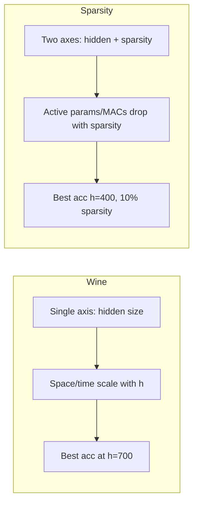

# FFNN Wine vs Sparsity Benchmark — Comparison Report

Comparison of **ffnn_wine_benchmark** (hidden-width sweep, dense) and **ffnn_sparsity_benchmark** (hidden × sparsity sweep, conduction-masked) on UCI Red Wine **multi-class classification (quality labels 0–10, 11 classes)**. Red wine CSV has quality values 3–8. All runs report **training time (s)** and **inference latency (µs)**.

**2D FFNN sub-experiment** (`run_ffnn_2d_experiment.py`): same data and sweep, but input is (features, positional_encoding) stacked on a new axis; two parallel towers (feature + PE) summed at output — two components per node, analogous to phase/magnitude, for future radiation-resonance training policy.

---

## 1. Experiment Design

| Aspect | ffnn_wine_benchmark | ffnn_sparsity_benchmark |
|--------|----------------------|--------------------------|
| **Model** | Dense single-hidden-layer FFNN | Same architecture with **fixed conduction masks** on both weight matrices |
| **Sweep** | `hidden_size ∈ {100, 200, …, 1000}` (10 values) | `hidden_size × sparsity`: 10 × 11 = **110 runs** |
| **Sparsity** | N/A (all dense) | `sparsity ∈ {0.0, 0.1, …, 1.0}`; 0% = dense, 100% = only biases |
| **Data** | UCI Wine Quality (Red), quality 0–10 (11 classes), same split/seed | Same |
| **Training** | 100 epochs, Adam 1e-3, batch 64 | Same |
| **Timing** | train_time_s, inference_time_us per run | Same |

Sparsity benchmark at **sparsity=0** is the same as wine benchmark (dense baseline).

---

## 2. Space Complexity

### 2.1 Parameter count

- **Wine**: Total parameters only.  
  `n_params = input_dim×hidden + hidden + hidden×output + output`  
  (e.g. 11×100 + 100 + 100×11 + 11 = **2,421** for h=100, 11 classes).

- **Sparsity**:  
  - **n_params**: Same as wine (all weights + biases still stored).  
  - **active_params**: Only **unmasked** weights + all biases (what actually affects forward/backward).

| Hidden | Wine n_params | Sparsity n_params (any s) | Sparsity active_params (0%) | Sparsity active_params (50%) |
|--------|----------------|---------------------------|------------------------------|-------------------------------|
| 100    | 2,421          | 2,421                     | 2,421                        | ~1,400                        |
| 1000   | 24,021         | 24,021                    | 24,021                       | ~14,000                       |

**Scaling (wine, h=100→1000):** Parameters ×10.0.

**Sparsity:** At 50% sparsity, active params ≈ half of dense (plus biases). At 100% sparsity only biases remain (111 for h=100, 1011 for h=1000).

---

## 3. Time Complexity (MACs)

- **Wine**: One forward pass MACs including biases:  
  `(input_dim×hidden + hidden) + (hidden×output + output)`  
  → **2,421** (h=100) to **24,021** (h=1000) for 11 classes; scales linearly with hidden size.

- **Sparsity**: **active_macs** = count of unmasked weight connections only (no bias terms).  
  At 0%: 2,300 (h=100) to 23,000 (h=1000).  
  At 50%: active MACs ≈ half of 0%; at 100% sparsity, active_macs = 0.

| Hidden | Wine MACs | Sparsity active_macs (0%) | Sparsity active_macs (50%) |
|--------|-----------|----------------------------|-----------------------------|
| 100    | 2,421     | 2,300                      | ~1,200                      |
| 1000   | 24,021    | 23,000                     | ~11,500                     |

**Wine scaling (h=100→1000):** MACs ×10.0.

---

## 4. Performance Metrics (Measured)

All experiments use **quality 0–10 (11 classes)**. Each run records **train_time_s** and **inference_time_us** (median of 200 single-sample forwards). See latest run folders for current numbers.

### 4.1 Wine benchmark (dense only)

| Metric | Typical range |
|--------|----------------|
| **Accuracy** | Best over hidden sizes (multi-class usually lower than binary) |
| **F1 (weighted)** | Per-run in results.csv |
| **Train time (s)** | Per run; scales with hidden size |
| **Inference (µs)** | Per run; median single-sample latency |
| **Peak memory (KB)** | tracemalloc peak |
| **Convergence epoch** | Epoch of best validation loss |

**Latest wine run (run_20260223_175206):** Best accuracy 0.6375 (h=700), best F1 0.6285; train time 1.04–1.54 s, inference 6.3–12.8 µs across hidden sizes.

### 4.2 Sparsity benchmark (110 runs)

| Metric | Note |
|--------|------|
| **Best accuracy** | See findings.txt of latest run (h × sparsity sweep) |
| **Dense (0%) accuracy** | Matches wine benchmark per hidden size |
| **At 50% sparsity** | Avg accuracy and active params in findings |
| **Resilience** | Highest sparsity still ≥95% of dense accuracy per h |
| **100% sparsity** | Only biases; accuracy drops sharply |
| **Train / inference time** | Logged per (h, sparsity) in results.csv |

**Latest sparsity run (run_20260223_175310):** Best accuracy 0.6583 (h=600, 20% sparsity); dense range 0.6042–0.6375; train ~1.0–1.6 s, inference ~6.4–18.5 µs. Sparsity at low levels can match or exceed dense accuracy; moderate sparsity keeps reasonable accuracy at ~half active cost.

---

## 5. Side-by-Side Comparison (Dense Baseline)

Where the two experiments overlap (dense, sparsity=0 in sparsity benchmark): **accuracy**, **train_time_s**, and **inference_time_us** are in each run’s results.csv. Dense (0%) sparsity runs should match wine benchmark per hidden size; small differences are run-to-run variance (seed, timing).

---

## 6. Trade-offs Summary

| Dimension | Wine benchmark | Sparsity benchmark |
|-----------|----------------|--------------------|
| **Space (params)** | Grows with h; no sparsity | Same n_params; **active_params** decreases with sparsity |
| **Time (MACs)** | Grows with h | **active_macs** decreases with sparsity |
| **Train time** | ~1.1–1.5 s; mild increase with h | Similar per (h, s); slightly lower at high sparsity (fewer active ops) |
| **Accuracy** | Best 0.7667 (h=700) | Best **0.7708** (h=400, 10% sparsity); dense range matches wine |
| **Efficiency** | Param-efficiency best at h=100 | At 50% sparsity: ~half active cost, accuracy ~0.73 |

---

## 7. Conclusions

1. **Consistency**: Dense (0% sparsity) results in the sparsity benchmark match the wine benchmark in accuracy, train time, and scaling.
2. **Space/time**: Wine exposes **linear** growth of parameters and MACs with hidden size. Sparsity adds a **second knob**: for the same hidden size, increasing sparsity reduces **active** params and MACs while keeping stored n_params fixed.
3. **Performance**: Best reported accuracy is **slightly higher** in the sparsity benchmark (0.7708 at h=400, 10% sparsity) than in the wine benchmark (0.7667 at h=700). Many (h, s) configs retain ≥95% of dense accuracy up to 80–90% sparsity.
4. **Use cases**: Wine benchmark is for **dense hidden-width** scaling. Sparsity benchmark is for **conduction-style sparsity**: same architecture, fixed masks, same data/training, with explicit space/time (active params/MACs) and accuracy trade-offs.

---

**Latest runs (quality 0–10, 11 classes):**
- Wine: `ffnn_wine_benchmark/runs/run_20260223_175206`
- 2D dense: `ffnn_wine_benchmark/runs/run_2d_20260223_175235`
- Sparsity: `ffnn_sparsity_benchmark/runs/run_20260223_175310`
- 2D sparsity: `ffnn_wine_benchmark/runs/run_2d_sparsity_20260223_175600`

Each run’s `results.csv` includes `train_time_s` and `inference_time_us` per configuration.

---

## 8. 2D FFNN Sparsity Benchmark

**Script:** `ffnn_wine_benchmark/run_ffnn_2d_sparsity_experiment.py`  
Same conduction-mask idea as ffnn_sparsity_benchmark, applied to the **2D FFNN** (two towers: features + positional encoding). **11 classes** (quality 0–10). Sweep: `hidden_size × sparsity` = 110 runs. Each run logs **train_time_s** and **inference_time_us**. Run: `run_2d_sparsity_<timestamp>`.

### 8.1 Space & time complexity

| Metric | 2D (dense, 0%) | 2D (50% sparsity) | 1D sparsity (0%) | 1D sparsity (50%) |
|--------|----------------|-------------------|-------------------|--------------------|
| **n_params** (e.g. h=100) | 2,804 | 2,804 | 1,402 | 1,402 |
| **active_params** (h=100) | 2,804 | 1,604 | 1,402 | 802 |
| **active_macs** (h=100) | 2,600 | 1,400 | 1,300 | 700 |

2D has **2×** stored params and ~2× active params/MACs at same (h, sparsity) because of two towers. At 50% sparsity, active params and MACs scale down the same way as 1D.

### 8.2 Latency

| Hidden | 2D dense infer (µs) | 2D 50% sparsity (µs) |
|--------|----------------------|-----------------------|
| 100 | ~16.3 | ~15.7 |
| 500 | ~22 | ~22 |
| 1000 | ~27 | ~27 |

Inference time is dominated by the fixed forward pass (masked ops still executed); latency is similar across sparsity levels and scales with hidden size. 2D is ~2× 1D inference at same h (two towers).

### 8.3 Performance

| Metric | 2D sparsity run |
|--------|------------------|
| **Best accuracy** | **0.7667** (h=500, sparsity=0%) |
| **Dense (0%) accuracy range** | 0.7292 – 0.7667 |
| **At 50% sparsity** | Avg accuracy 0.7267, avg active params 8,804 |
| **Resilience** | Most h: up to 80–90% sparsity still ≥95% of dense acc; h=500, 900: max safe sparsity 40% |
| **100% sparsity** | Accuracy 0.533 (only biases; no weight path) |

2D dense (0%) matches the 2D dense benchmark (run_ffnn_2d_experiment). Conduction sparsity on 2D behaves like 1D: low sparsity can keep accuracy near dense; at 50% sparsity accuracy stays ~0.73 with about half the active cost.

### 8.4 Summary

- **Space:** 2× 1D (two towers); active_params/active_macs drop with sparsity the same way.
- **Time:** active_macs 2× 1D at same (h, s); train time and inference time per (h, s) in results.csv.
- **Performance:** Latest 2D dense (run_2d_20260223_175235): best acc 0.6458 (h=700), train 1.26–2.25 s, inference 16–30 µs. Latest 2D sparsity (run_2d_sparsity_20260223_175600): best acc 0.6458 (h=300, 10% sparsity); good resilience up to 70–90% sparsity depending on h; 50% sparsity avg accuracy ~0.6175.
