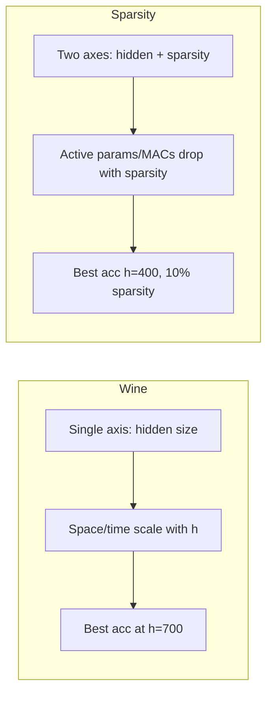

# FFNN Wine vs Sparsity Benchmark — Comparison Report

Comparison of **ffnn_wine_benchmark** (hidden-width sweep, dense) and **ffnn_sparsity_benchmark** (hidden × sparsity sweep, conduction-masked) on UCI Red Wine binary classification.

---

## 1. Experiment Design

| Aspect | ffnn_wine_benchmark | ffnn_sparsity_benchmark |
|--------|----------------------|--------------------------|
| **Model** | Dense single-hidden-layer FFNN | Same architecture with **fixed conduction masks** on both weight matrices |
| **Sweep** | `hidden_size ∈ {100, 200, …, 1000}` (10 values) | `hidden_size × sparsity`: 10 × 11 = **110 runs** |
| **Sparsity** | N/A (all dense) | `sparsity ∈ {0.0, 0.1, …, 1.0}`; 0% = dense, 100% = only biases |
| **Data** | UCI Wine Quality (Red), binary quality ≥6, same split/seed | Same |
| **Training** | 100 epochs, Adam 1e-3, batch 64 | Same |

Sparsity benchmark at **sparsity=0** is the same as wine benchmark (dense baseline).

---

## 2. Space Complexity

### 2.1 Parameter count

- **Wine**: Total parameters only.  
  `n_params = input_dim×hidden + hidden + hidden×output + output`  
  (e.g. 11×100 + 100 + 100×2 + 2 = **1,402** for h=100).

- **Sparsity**:  
  - **n_params**: Same as wine (all weights + biases still stored).  
  - **active_params**: Only **unmasked** weights + all biases (what actually affects forward/backward).

| Hidden | Wine n_params | Sparsity n_params (any s) | Sparsity active_params (0%) | Sparsity active_params (50%) |
|--------|----------------|---------------------------|------------------------------|-------------------------------|
| 100    | 1,402          | 1,402                     | 1,402                        | 802                           |
| 1000   | 14,002         | 14,002                    | 14,002                       | 8,002                         |

**Scaling (wine, h=100→1000):** Parameters ×10.0.

**Sparsity:** At 50% sparsity, active params ≈ half of dense (plus biases). At 100% sparsity only biases remain (102 for h=100, 1002 for h=1000).

---

## 3. Time Complexity (MACs)

- **Wine**: One forward pass MACs including biases:  
  `(input_dim×hidden + hidden) + (hidden×output + output)`  
  → **1,402** (h=100) to **14,002** (h=1000); scales linearly with hidden size.

- **Sparsity**: **active_macs** = count of unmasked weight connections only (no bias terms).  
  At 0%: 1,300 (h=100) to 13,000 (h=1000).  
  At 50%: active MACs ≈ half of 0%; at 100% sparsity, active_macs = 0.

| Hidden | Wine MACs | Sparsity active_macs (0%) | Sparsity active_macs (50%) |
|--------|-----------|----------------------------|-----------------------------|
| 100    | 1,402     | 1,300                      | 700                         |
| 1000   | 14,002    | 13,000                     | 7,000                       |

**Wine scaling (h=100→1000):** MACs ×10.0.

---

## 4. Performance Metrics (Measured)

### 4.1 Wine benchmark (dense only)

| Metric | Best | At h=100 | At h=1000 | Scaling (100→1000) |
|--------|------|----------|-----------|---------------------|
| **Accuracy** | **0.7667** (h=700) | 0.7375 | 0.7542 | +0.0167 |
| **F1 (weighted)** | 0.7669 (h=700) | 0.7378 | 0.7544 | — |
| **Train time (s)** | 1.15 (h=200) | 1.20 | 1.47 | ×1.2 |
| **Inference (µs)** | 6.5 (h=100,200) | 6.5 | 12.29 | ×1.9 |
| **Peak memory (KB)** | ~82–84 (h≥200) | 263.79 | 82.54 | — |
| **Convergence epoch** | 27 (h=800) | 93 | 39 | — |

Findings (wine): Best accuracy at h=700; most param-efficient at h=100; train time and inference scale sub-linearly with params/MACs.

### 4.2 Sparsity benchmark (110 runs)

| Metric | Best / Note |
|--------|-------------|
| **Best accuracy** | **0.7708** at h=400, **sparsity=10%** (slightly better than wine best) |
| **Dense (0%) accuracy** | 0.7375 – 0.7667 (matches wine per hidden size) |
| **At 50% sparsity** | Avg accuracy 0.7279, avg active params 4,402 |
| **Resilience** | Up to 80–90% sparsity still ≥95% of dense accuracy for many hidden sizes |
| **100% sparsity** | Accuracy collapses to ~0.53 (only biases; no weight path) |

So: **sparsity can match or slightly exceed dense accuracy** at low sparsity (e.g. 10%) while reducing active params/MACs; moderate sparsity (e.g. 50%) keeps reasonable accuracy with ~half the active cost.

---

## 5. Side-by-Side Comparison (Dense Baseline)

Where the two experiments overlap (dense, sparsity=0 in sparsity benchmark):

| Hidden | Wine acc | Wine train (s) | Wine infer (µs) | Sparsity (0%) acc | Sparsity (0%) train (s) | Sparsity (0%) infer (µs) |
|--------|-----------|----------------|------------------|--------------------|---------------------------|----------------------------|
| 100    | 0.7375    | 1.198          | 6.5              | 0.7375             | 1.134                     | 6.666                     |
| 700    | **0.7667**| 1.453          | 11.542           | **0.7667**        | 1.492                     | 12.458                    |
| 1000   | 0.7542    | 1.47           | 12.292           | 0.7542             | 1.469                     | 15.208                    |

Dense runs are consistent across both benchmarks; small differences are run-to-run variance (seed, timing).

---

## 6. Trade-offs Summary

| Dimension | Wine benchmark | Sparsity benchmark |
|-----------|----------------|--------------------|
| **Space (params)** | Grows with h; no sparsity | Same n_params; **active_params** decreases with sparsity |
| **Time (MACs)** | Grows with h | **active_macs** decreases with sparsity |
| **Train time** | ~1.1–1.5 s; mild increase with h | Similar per (h, s); slightly lower at high sparsity (fewer active ops) |
| **Accuracy** | Best 0.7667 (h=700) | Best **0.7708** (h=400, 10% sparsity); dense range matches wine |
| **Efficiency** | Param-efficiency best at h=100 | At 50% sparsity: ~half active cost, accuracy ~0.73 |

---

## 7. Conclusions

1. **Consistency**: Dense (0% sparsity) results in the sparsity benchmark match the wine benchmark in accuracy, train time, and scaling.
2. **Space/time**: Wine exposes **linear** growth of parameters and MACs with hidden size. Sparsity adds a **second knob**: for the same hidden size, increasing sparsity reduces **active** params and MACs while keeping stored n_params fixed.
3. **Performance**: Best reported accuracy is **slightly higher** in the sparsity benchmark (0.7708 at h=400, 10% sparsity) than in the wine benchmark (0.7667 at h=700). Many (h, s) configs retain ≥95% of dense accuracy up to 80–90% sparsity.
4. **Use cases**: Wine benchmark is for **dense hidden-width** scaling. Sparsity benchmark is for **conduction-style sparsity**: same architecture, fixed masks, same data/training, with explicit space/time (active params/MACs) and accuracy trade-offs.

---

*Data: Wine run 20260218_233822; Sparsity run 20260219_231146.*
